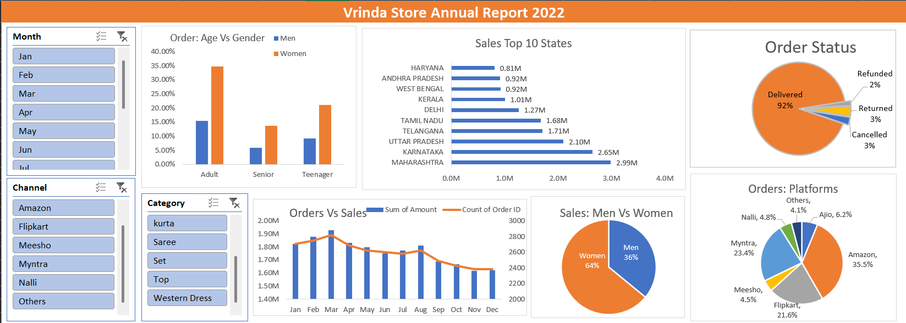

# 📊 Vrinda Store Annual Sales Analysis – 2022

A complete Excel-based data analytics project featuring data cleaning, visualization, KPI analysis, and an interactive dashboard.

---

## 📑 Table of Contents
- [Project Summary](#-project-summary)
- [Files in This Repository](#-files-in-this-repository)
- [Overview](#-overview)
- [Problem Statement](#-problem-statement)
- [Dataset Description](#-dataset-description)
- [Tools & Technologies Used](#-tools--technologies-used)
- [Methods & Workflow](#-methods--workflow)
- [Dashboard Preview](#-dashboard-preview)
- [How to Run the Project](#-how-to-run-the-project)
- [Key Insights](#-key-insights)
- [Results & Conclusion](#-results--conclusion)
- [Future Work & Recommendations](#-future-work--recommendations)
- [Author & Contact](#-author--contact)

---

## 📘 Project Summary
This project analyzes **Vrinda Store’s 2022 annual sales data** to uncover customer behavior, state-wise performance, product demand, and channel efficiency.  
The analysis uses **Microsoft Excel** to transform raw data into meaningful business insights through cleaning, modeling, feature engineering, and dashboard visualization.

It demonstrates strong Excel skills, analytical thinking, and the ability to convert raw data into actionable business intelligence.

---

## 📁 Files in This Repository

```
Vrinda-Store-Analysis/
├── vrinda_store_annual_sales_analysis_dataset_and_dashboard.xlsx             # Cleaned dataset + dashboard workbook
├── vrinda_store_annual_sales_analysis_dashboard_image.png                    # Dashboard screenshot
├── vrinda_store_annual_sales_analysis_report.pdf                             # Detailed project report (optional)
└── README.md                                                                 # Project documentation
```

---

## 🔍 Overview
The Vrinda Store Sales Analysis is a complete end-to-end Excel data analytics project involving:

- Data cleaning  
- Data transformation  
- KPI formulation  
- Dashboard creation  
- Insight generation  

The final dashboard gives business leaders a clear view of **who buys, what they buy, and where the revenue originates**.

---

## ❗ Problem Statement
Vrinda Store needed a structured analysis of its sales performance, but the original data was:

- Unclean  
- Unformatted  
- Missing standardized fields  
- Not summarized for business insight  

The challenge was to:

➡️ Clean and organize the dataset  
➡️ Build KPIs and meaningful summaries  
➡️ Visualize the results in a dynamic dashboard  

---

## 🗂 Dataset Description
The dataset includes:

- Order ID  
- Customer gender & age group  
- Product category  
- Sales channel (Amazon, Myntra, Flipkart, etc.)  
- State of customer  
- Order status (Delivered / Cancelled / Returned)  
- Sales amount  
- Purchase date  

**Uploaded Project Assets:**  
- `Vrinda Store Data Analysis.xlsx`  
- `VRINDA STORE DASHBOARD.png`  
- `Vrinda_Store_Analysis_Report.pdf`

---

## 🛠 Tools & Technologies Used

**Software:**  
- Microsoft Excel (Primary Tool)

**Excel Features:**  
- Pivot Tables  
- Pivot Charts  
- Slicers  
- Conditional Formatting  
- Data Validation  

**Formulas Used:**  
`TRIM`, `CLEAN`, `IF`, `IFS`, `IFERROR`,  
`DATE`, `MONTH`, `YEAR`,  
`VLOOKUP`, `XLOOKUP`

**Chart Types:**  
- Bar  
- Line  
- Column  
- Donut  
- Pie  
- Combo  

---

## 🔧 Methods & Workflow

### 1️⃣ Data Cleaning
- Removed duplicates  
- Fixed inconsistent formatting  
- Standardized dates and categories  
- Handled missing values  

### 2️⃣ Feature Engineering
- Extracted Month & Year  
- Created Age Groups  
- Normalized Channel Names  

### 3️⃣ Pivot Modeling
- Sales summaries  
- Channel analytics  
- Age & gender insights  
- State-wise performance  

### 4️⃣ Dashboard Construction
- KPI cards  
- Combo trend charts  
- Pie charts for demographics  
- Bar charts for state/category revenue  
- Slicers for filtering  

### 5️⃣ Insight Extraction
- Seasonal patterns  
- Channel profitability  
- Demographic contributions  

---

## 🖼 Dashboard Preview



---

## ▶ How to Run the Project
1. Download:
   - `Vrinda Store Data Analysis.xlsx`
   - Dashboard image  
   - Report (optional)

2. Open the Excel file in **Microsoft Excel 2016 or later**.

3. Navigate to the **Dashboard** tab.

4. Use slicers to filter by:
   - Month  
   - Channel  
   - Category  

5. Explore visuals including:
   - Sales trends  
   - State performance  
   - Gender & age analysis  
   - Order status  

No external tools or libraries required.

---

## 📈 Key Insights

- **Women contribute 59% of total purchases**.  
- **Amazon (35.9%)**, **Myntra (22.8%)**, and **Flipkart (21.8%)** are top channels.  
- **Maharashtra, Karnataka & Uttar Pradesh** generate the highest revenue.  
- Sales peak between **March–August**.  
- Top categories include **Kurta, Saree, Western Dress, Set Wear**.  
- **95% delivery success rate** shows operational efficiency.  

---

## 🏁 Results & Conclusion
This project successfully:

- Cleaned and transformed raw sales data  
- Built meaningful KPIs  
- Created a professional Excel dashboard  
- Revealed customer and location-based sales patterns  
- Identified top-performing channels and categories  

It demonstrates strong capabilities in **data analysis, visualization, and business intelligence storytelling**, making it suitable for Data Analyst and Business Analyst portfolios.

---

## 🔮 Future Work & Recommendations
Enhancements that can be added:

- Convert the dashboard to **Power BI** for advanced interactivity  
- Build predictive sales models  
- Perform customer retention and cohort analysis  
- Use macros or Python for automation  
- Add profitability and inventory forecasting metrics  

---

## 👤 Contact  

**Risit Sahoo**  
📧 Email: risit.sahoo121@gmail.com  
🔗 LinkedIn: https://linkedin.com/in/risitsahoo

